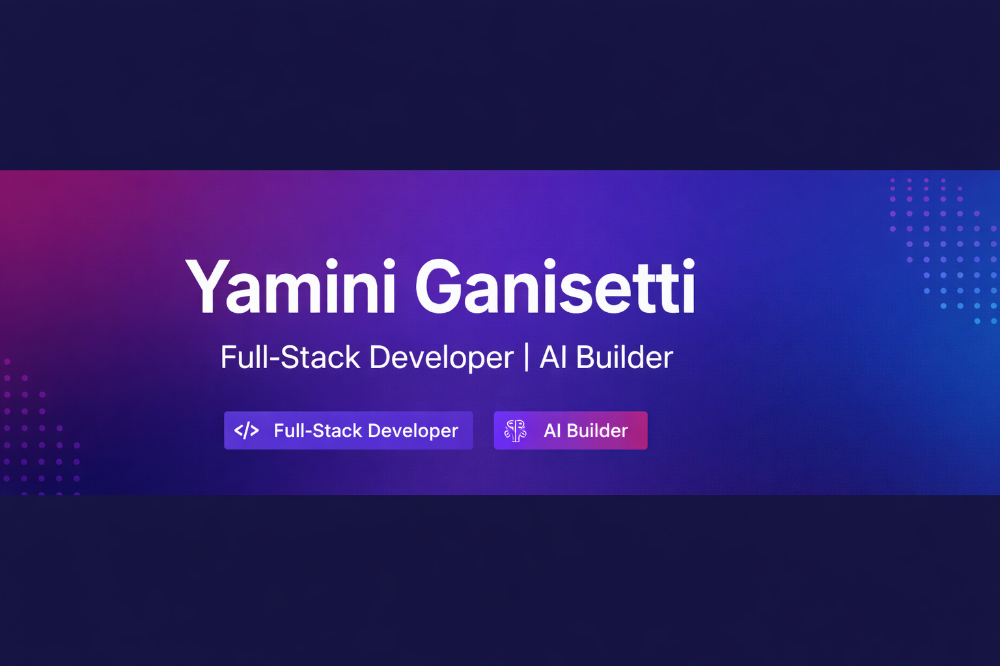

  

<h1 align="center">Yamini Ganisetti 👩‍💻</h1>
<h3 align="center">Full-Stack Developer • AI Enthusiast • Product Builder 🚀</h3>

  Turning ideas into real-world products with code, creativity, and consistency.

---

  
  
  
  

---

## 🧠 About Me

- 🔭 Currently building **RideMate** – a smart ride booking platform  
- 🌱 Learning **advanced React, Node.js, and AI integrations**  
- 👯 Open to collaborating on **full-stack & AI projects**  
- 💬 Ask me about **web dev, startup ideas, and product building**  
- ⚡ Fun fact: I turn random ideas into working products (2 AM mode 😄)  

---

## ✨ Profile Snapshot

<table>
<tr>
<td width="60%">

### 👩‍💻 Who I Am  
I’m a builder who loves creating practical, real-world products.  
I focus on clean UI, strong backend logic, and scalable ideas.

### 🚀 What I’m Building  
- RideMate (Ride booking platform)  
- AI-based tools  
- Full-stack web applications  

### 🎯 Goal  
To build impactful products that people actually use.

</td>

<td width="40%">
  
</td>
</tr>
</table>

---

## 💻 Tech Stack

  

---

## 🚀 Featured Project

### RideMate  
A smart ride booking system focused on real-world usability.

✔ Real-time tracking  
✔ Driver accept/reject system  
✔ UPI & COD payments  
✔ Admin dashboard insights  

---

## 📊 GitHub Stats

  
  

  

---

## 🌐 Connect With Me

  

---

## 🧠 Philosophy

> Build. Break. Fix. Ship. Repeat.

---

  ⭐ Not just learning tech — building things that actually work.

